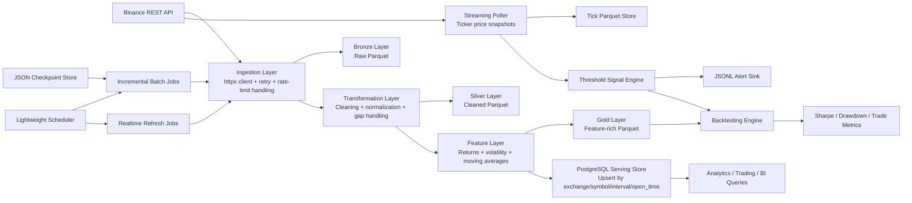

# Market Data Platform for Analytics Execution

A production-style ETL and market-signal platform for crypto data that ingests Binance OHLCV candles, normalizes time-series records, engineers analytics-ready features, stores curated data in Parquet and PostgreSQL, runs batch and near-real-time pipelines, emits threshold alerts, and supports simple historical backtesting.

## Why this project exists

This repository is designed as a portfolio project for Data Engineer roles. It is intentionally built like a small production system instead of a notebook or one-off script:

- resilient API ingestion with retry and backoff
- modular extract / transform / load layers
- checkpoint-based incremental loading
- lakehouse-style bronze / silver / gold outputs
- PostgreSQL serving layer for analytics queries
- polling-based streaming ticker pipeline with threshold alerts
- reusable threshold strategy backtester with Sharpe and drawdown metrics
- Dockerized execution model
- structured logging and operational controls

## System design



## Data flow

1. The ingestion layer calls Binance `/api/v3/klines` for historical or recent candles.
2. Raw API responses are persisted to the `bronze` Parquet layer for traceability.
3. The transformation layer normalizes numeric types and timestamps, removes duplicates, and optionally synthesizes missing bars.
4. The feature layer adds returns, log returns, rolling moving averages, and rolling volatility.
5. Cleaned data is written to the `silver` Parquet layer and feature-rich data is written to the `gold` Parquet layer.
6. The final serving frame is upserted into PostgreSQL for analytics and downstream consumers.
7. Batch jobs persist watermarks in a JSON checkpoint store so incremental loads resume from the last successful bar.
8. A second polling-based streaming pipeline samples ticker prices every few seconds, persists tick snapshots, and triggers threshold alerts without waiting for batch jobs.
9. The backtesting layer reuses the same threshold logic over historical closes to simulate basic long-flat trading behavior and calculate portfolio metrics.

## Project structure

```text
.
|-- .env.example
|-- Dockerfile
|-- docker-compose.yml
|-- examples/
|   `-- analytics_queries.sql
|-- pyproject.toml
|-- sql/
|   `-- postgres/
|       `-- 001_create_market_data.sql
|-- src/
|   `-- market_data_platform/
|       |-- cli.py
|       |-- config.py
|       |-- contracts.py
|       |-- logging_utils.py
|       |-- schema.py
|       |-- ingestion/
|       |   |-- base.py
|       |   `-- binance.py
|       |-- monitoring/
|       |   `-- metrics.py
|       |-- orchestration/
|       |   |-- jobs.py
|       |   `-- scheduler.py
|       |-- quant/
|       |   |-- backtesting.py
|       |   `-- metrics.py
|       |-- signals/
|       |   |-- models.py
|       |   `-- thresholds.py
|       |-- storage/
|       |   |-- parquet.py
|       |   |-- postgres.py
|       |   `-- state.py
|       |-- streaming/
|       |   |-- models.py
|       |   |-- pipeline.py
|       |   `-- storage.py
|       `-- transformation/
|           |-- cleaning.py
|           `-- features.py
`-- tests/
    |-- test_backtesting.py
    |-- test_cleaning.py
    |-- test_features.py
    `-- test_streaming.py
```

## Storage design

### Parquet lakehouse

- `bronze`: raw extracted API payloads for replayability and traceability
- `silver`: cleaned and normalized OHLCV records
- `gold`: feature-rich records ready for analytics or model inputs

Each Parquet layer is partitioned by:

- `exchange`
- `symbol`
- `interval`
- `date`

This makes local exploration efficient and mirrors how a cloud data lake would be partitioned in S3, ADLS, or GCS.

### PostgreSQL serving schema

The main table is `market_ohlcv_features` with primary key:

- `(exchange, symbol, interval, open_time)`

This gives deterministic upserts for replayed or late-arriving data and supports efficient point-in-time analytics.

### Streaming alert artifacts

The streaming pipeline writes:

- tick snapshots to partitioned Parquet under `data/streaming/ticks`
- threshold alerts to JSONL under `data/alerts/threshold_alerts.jsonl`

This keeps the stream runnable without adding a message bus while still showing an event-oriented architecture.

## Key engineering choices

### 1. Binance REST instead of streaming WebSockets

Why:

- simpler to explain and run in a portfolio environment
- enough to demonstrate pagination, retries, rate-limit handling, and incremental loading
- the second pipeline still simulates realtime behavior by polling the live ticker endpoint

Trade-off:

- true low-latency trading feeds would use WebSockets or Kafka

### 2. Bronze / Silver / Gold layers

Why:

- shows modern data engineering thinking
- preserves raw lineage and supports replay
- separates cleansing from business logic

Trade-off:

- more storage overhead than a single-table design

### 3. Parquet plus PostgreSQL

Why:

- Parquet is the analytics-optimized storage layer
- PostgreSQL is the query-serving layer recruiters expect you to know

Trade-off:

- dual-write systems are more complex than a single sink

### 4. JSON checkpoint store instead of Airflow metadata DB

Why:

- keeps the project runnable anywhere
- still demonstrates watermark-based incremental processing

Trade-off:

- single-node only and not suitable for distributed orchestration

### 5. Synthetic bar generation is configurable

Why:

- analytics often want a complete time index
- trading systems may prefer gaps over imputation

Trade-off:

- synthesized bars improve continuity but can hide upstream outages if not tracked

The pipeline marks synthetic rows with `is_synthetic = true` so downstream consumers can filter them.

### 6. Reuse threshold logic in both live alerts and backtests

Why:

- it demonstrates that streaming and research paths share the same decision rules
- it reduces drift between what is monitored live and what is tested historically

Trade-off:

- the current strategy logic is intentionally simple and not execution-model aware

## How to run

### Option 1: Docker Compose

1. Copy `.env.example` to `.env`.
2. Start services:

```bash
docker compose up --build
```

This starts:

- PostgreSQL on port `5432`
- the pipeline container running the scheduler

### Option 2: Local Python

1. Create and activate a virtual environment.
2. Install the project:

```bash
pip install -e .[dev]
```

3. Copy `.env.example` to `.env` and export the variables.

4. Bootstrap storage:

```bash
python -m market_data_platform.cli bootstrap
```

5. Run a historical backfill:

```bash
python -m market_data_platform.cli historical \
  --symbol BTCUSDT \
  --interval 1m \
  --start 2024-05-01T00:00:00+00:00 \
  --end 2024-05-02T00:00:00+00:00
```

6. Run an incremental batch load:

```bash
python -m market_data_platform.cli incremental \
  --symbol BTCUSDT \
  --interval 1m
```

7. Run a realtime refresh:

```bash
python -m market_data_platform.cli realtime \
  --symbol BTCUSDT \
  --interval 1m \
  --recent-bars 5
```

8. Run one streaming poll with alerts:

```bash
python -m market_data_platform.cli streaming \
  --symbol BTCUSDT \
  --rule "BTCUSDT|cross_above|70000|btc_breakout" \
  --run-once
```

9. Run the streaming pipeline continuously:

```bash
python -m market_data_platform.cli streaming \
  --symbol BTCUSDT \
  --rule "BTCUSDT|cross_above|70000|btc_breakout"
```

10. Run a simple threshold backtest:

```bash
python -m market_data_platform.cli backtest \
  --symbol BTCUSDT \
  --interval 1m \
  --start 2024-05-01T00:00:00+00:00 \
  --end 2024-05-07T00:00:00+00:00 \
  --entry-threshold 70000 \
  --exit-threshold 68000 \
  --output-path ./data/backtests/btc_threshold_backtest.csv
```

11. Run the scheduler:

```bash
python -m market_data_platform.cli scheduler
```

## Logging and monitoring

The pipeline emits JSON logs that include:

- job name
- symbol
- interval
- row counts extracted / cleaned / loaded
- current tick price and alert counts for the streaming pipeline
- processing window
- error payloads when failures occur

This is enough to plug into a log aggregator later or to demonstrate observability discipline in interviews.

## Example analytics usage

The file [`examples/analytics_queries.sql`](examples/analytics_queries.sql) includes:

- latest enriched candles
- daily completeness checks
- volatility screens

These queries show how the platform can serve analytics, dashboards, or simple strategy research.

## Testing

Run unit tests with:

```bash
pytest
```

Current tests cover:

- duplicate removal
- missing-bar synthesis
- rolling feature generation
- streaming threshold alerts
- backtest position logic and metric generation

## Design limitations

- The scheduler is single-process and single-node.
- The checkpoint store is file-based, not coordination-safe for multiple workers.
- Realtime ingestion is polling-based rather than event-driven.
- PostgreSQL loading uses `executemany`; a higher-throughput version would switch to `COPY`.
- There is no secrets manager or alerting integration yet.
- The backtester is intentionally simple and does not model slippage, partial fills, or order-book depth.

These are deliberate simplifications to keep the project easy to run while still demonstrating production-grade thinking.

## How this maps to real Data Engineering roles

This project demonstrates the same responsibilities that appear in mid-level and senior Data Engineer job descriptions:

- building ingestion services against external APIs
- designing batch and incremental pipelines
- modeling time-series data for analytics and serving use cases
- writing robust Python with logging, tests, and configuration
- balancing storage formats for cost and query performance
- managing operational concerns such as retries, idempotency, and replayability
- supporting downstream quant workflows with live signals and historical strategy validation

## How this bridges Data Engineering and Quant Trading systems

The bridge is the shared market data contract:

- the data engineering layer builds reliable, normalized, analytics-ready market datasets
- the streaming layer turns live market observations into event-driven alerts
- the quant layer reuses the same threshold logic on historical closes to estimate behavior before anything is automated

In a real trading stack, this separation matters:

- data engineering owns ingestion reliability, schemas, replayability, lineage, and storage cost
- quant systems own signal generation, research reproducibility, backtesting, and downstream execution interfaces

This project sits at the seam between the two. It shows you can build the platform that feeds signals and also understand how those signals are evaluated historically. That is valuable for roles that touch market data platforms, research infrastructure, trading analytics, or execution-support systems.

## How to present this in interviews

Talk through it in this order:

1. Problem: "I wanted a realistic ETL system for financial time-series data, not a toy script."
2. Architecture: "I separated extraction, transformation, storage, orchestration, and monitoring into clear modules."
3. Operational controls: "I added retry logic, rate-limit handling, JSON checkpoints, structured logs, and idempotent Postgres upserts."
4. Storage trade-offs: "I used Parquet for lakehouse-style analytics and PostgreSQL for low-friction SQL consumption."
5. Realtime relevance: "I added a second polling-based stream for live price alerts and used the same threshold logic in a historical backtester."
6. Limitations: "I intentionally stopped short of Kafka, full WebSockets, and execution simulation to keep the repo runnable, but the interfaces are designed so those upgrades are straightforward."

## Recommended upgrade path

If you want to extend this project after the portfolio baseline is stable, add the following in order:

1. Replace the scheduler with Airflow or Prefect.
2. Replace the JSON checkpoint store with PostgreSQL metadata tables.
3. Replace ticker polling with Binance WebSocket ingestion for lower-latency updates.
4. Add dbt models or SQL-based transformation layers on top of PostgreSQL.
5. Add a small dashboard in Streamlit, Superset, or Metabase.
6. Add richer backtesting assumptions such as slippage, fees by venue, and execution delays.
7. Add data quality expectations and alerting.

## What recruiters should see

This project signals:

- practical pipeline design
- production-minded engineering discipline
- clear understanding of data modeling and operational trade-offs
- awareness of how research and live signal systems consume market data
- enough software engineering rigor to contribute beyond notebooks and SQL-only workflows
